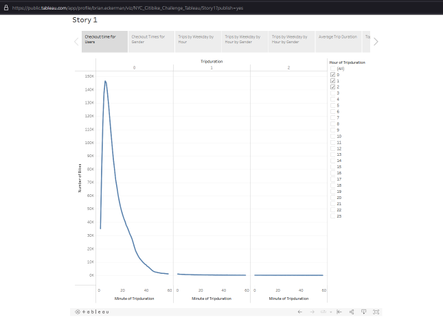
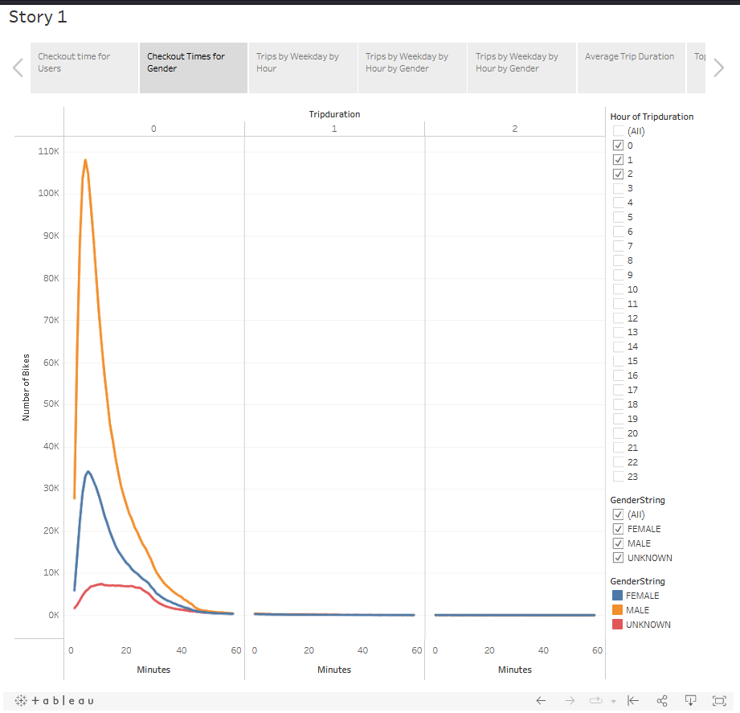
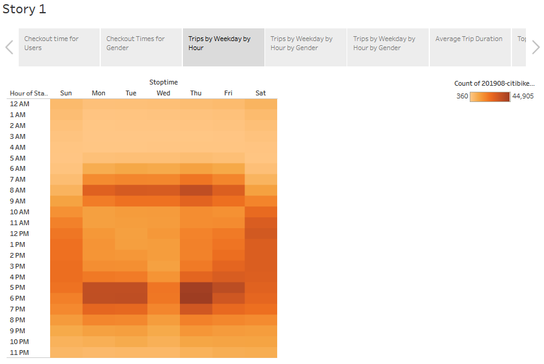
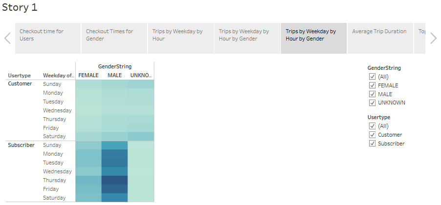
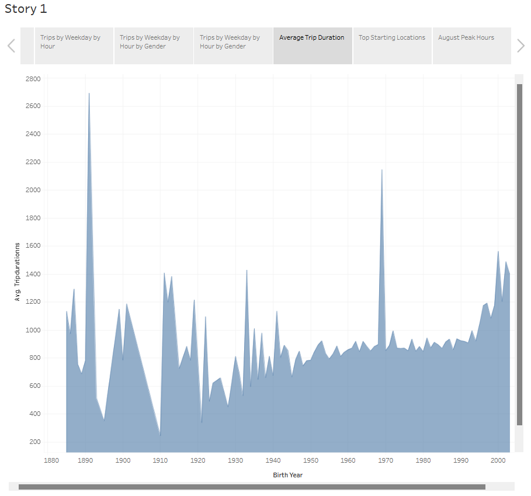
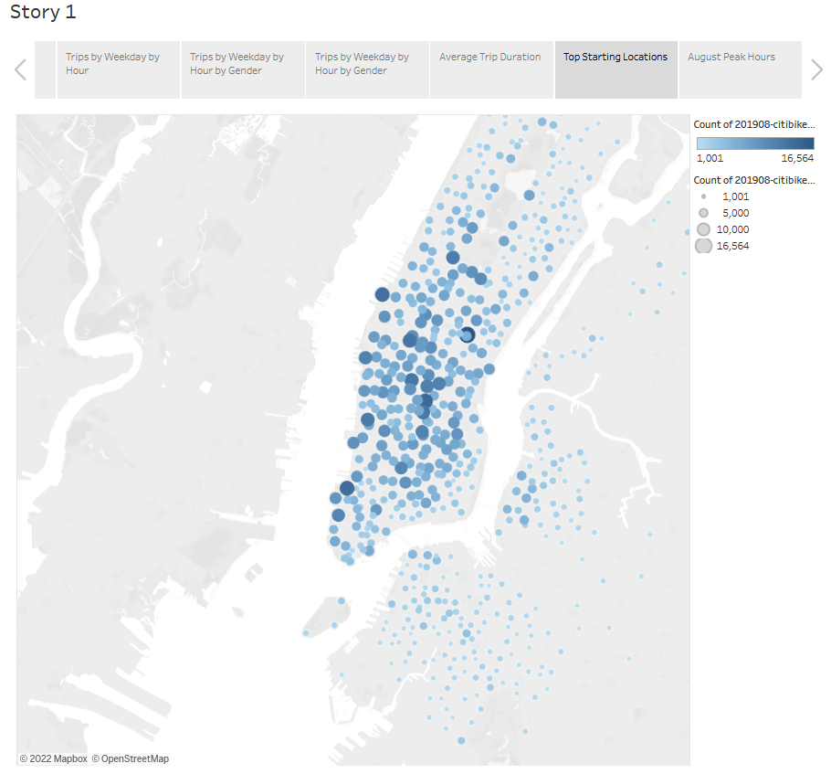
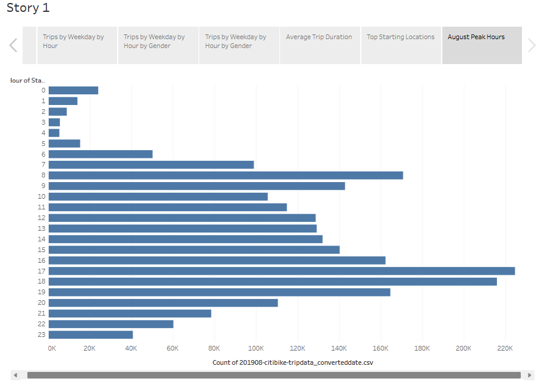

# The Purpose of this analysis is to determine if having a Bikeshare program in Des Moines Iowa would be a viable business.

A Data Story has been developed in Tableau to highlight some trends in data given in "201908-citibike-tripdata_converteddate.csv"

## 1. The following image reveals most trip durations are under an hour, with the largest share being approx. 1 to 25min.
1. 
---
## 2. Next, we can see a slight difference in gender participation 34K(F) vs 108K(M)
2. 
---
## 3. This img shows a clear difference between weekday and weekend, as well as a "rush-hour" in morning and evening
3. 
---
## 4. The same pattern shows up in both genders as shown here
4. 
---
## 5. This img draws a distinction between types of customers 
Subscribers are customers every day (mostly male), while ad-hoc customers are mostly weekend, and with only a tiny bit more gender bias.
5. 
---
---
# Some additional Visualizations:

## 6. This data is a bit erratic to make any conclusions about age and trip duration,
6. 
---
## 7. A map shows us that some areas are more popular than others.
7. 
---
## 8. For the month of August busiest hours were 5pm-7pm, with an additional peak at 8am
8. 
---
---
# Conclusions and recommendations
From the Visuals we can see that more men use the bike share program than women, but since bikes are commonly gender-neutral, it’s not clear if this is important.
Bike usage does appear to be linked to morning and evening commute during the week and all afternoon on weekends.
Perhaps a weekend pilot program in Des Moise would be a good idea, even coinciding with a subscriber and ad-hoc service.
The graph showing trip duration vs age did not have enough data to show clear patterns, 
perhaps if data was collected for a whole year this illustration would be clearer. 

This analysis has provided some valuable insights into busiest times of day and week, 
and how demographics can play a part in who finds the service to be the most desirable.

